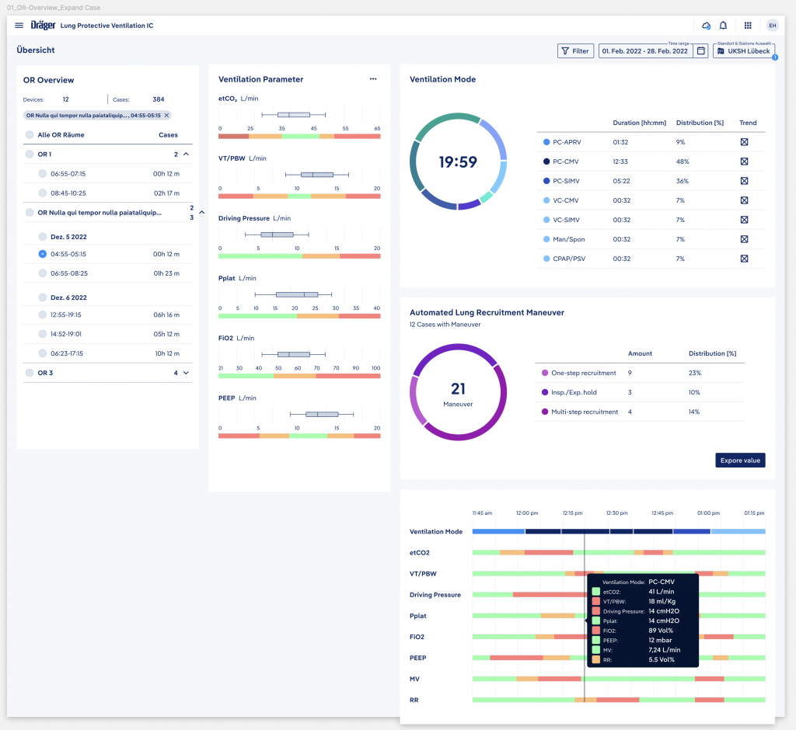
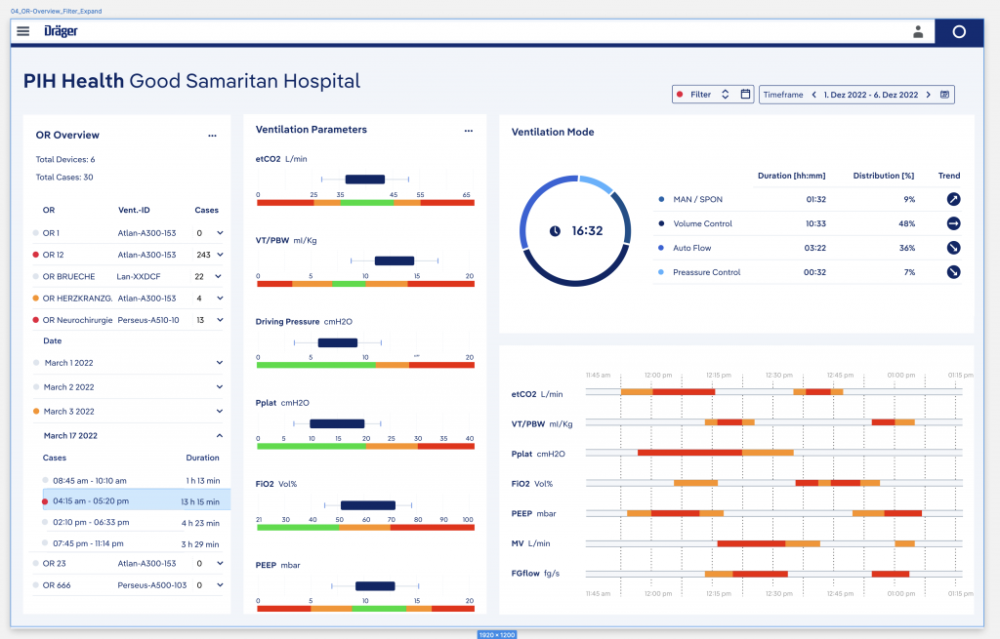
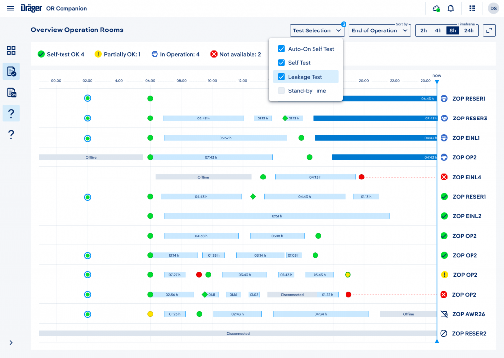

Konzeptentwicklung einer digitalen Gesundheitsanwendung in Kooperation mit einem Pharmahersteller.

- User-Storys schreiben, Wireframes wieder mit Stakeholdern und Entwicklern diskutieren, Modulkonzepte verwerfen und neue entwickeln. 
- Dies alles wurde in Jira-Tickets gegossen und Feedback der Entwickler abgeholt.
- Fragen zur Patientensicherheit in Confluence dokumentieren, mit dem Lastenheft abgleichen und Risikobeherrschungsmaßnahmen entwickeln. 
- Weitere Evaluationen an fortgeschrittenen Prototypen brachten neue Ergebnisse.
- Barrierefreiheit für Mobilgeräte und Desktop, ganzheitlich gedacht und mit der Entwicklung und Stakeholdern durchgesprochen und umgesetzt.
- Als das MVP am Horizont erschien, wurde ein UI entwickelt, Farbschemata mit dem CI des Pharmaherstellers abgeglichen, Formen, Fonts und erste Bildsprache entwickelt. 

Ein weiterer Teil meiner Arbeit bestand aus Konzeption sowie Design und Prototyping von Softwareoberflächen für Medizinischen Geräte, Erstellung von Design Systemen und Spezifikationen, Systemarchitektur, Wireframing und Mockups nach Human-Centered Design Prinzipien

